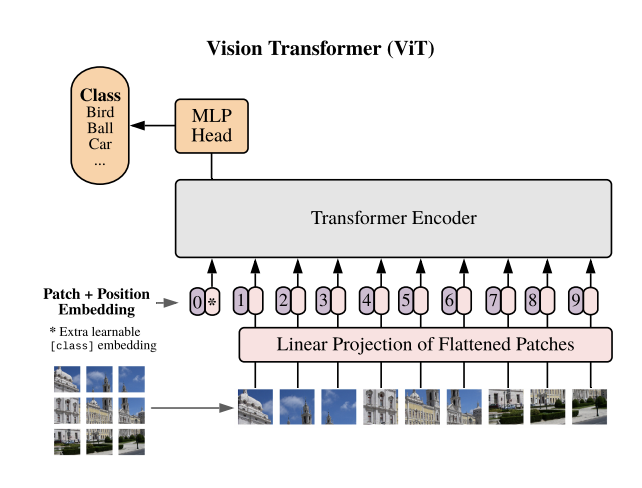
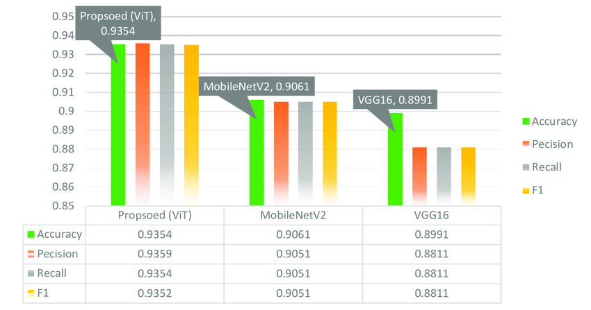
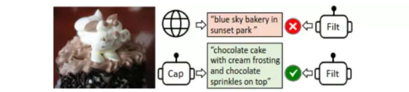
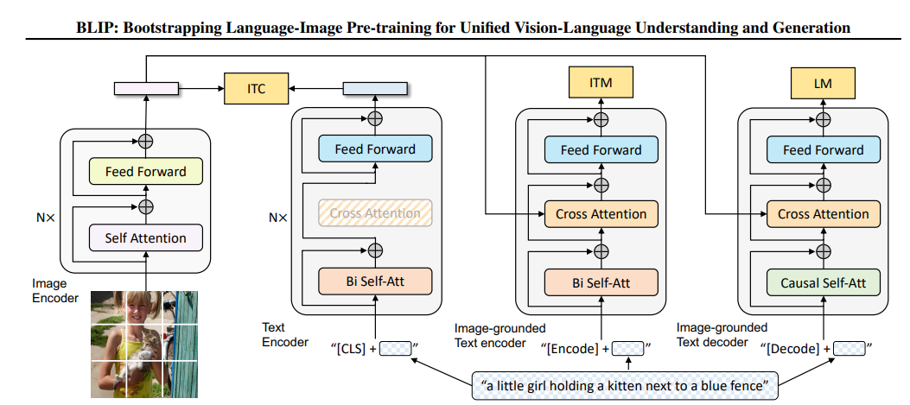

# Image Captioning

This repository contains an image captioning model implemented in Python.

## Getting Started

To get started with this project, follow the steps below:

### Prerequisites

Make sure you have Python 3.7 or higher installed. Additionally, you'll need the following Python packages:

- Streamlit
- Transformers
- Torch

## Clone the Repository
```
git clone https://github.com/annguyenphanhuu/image-captioning.git
```
## Run app.py
```
streamlit run app.py
```

## Models
1. **CNN + LSTM**:
- **Dataset**: Flickr8k
- ****Encoder**: 
    - VGG16: Images Feature Extraction
    - LSTM: Text Feature Encoding
    - Combining Image and Text Features
- **Decoder**:
    - The model generates a probability distribution for each word in the vocabulary
- **Experiment result**: The model's prediction performance is not good.
2. **ViT + GPT-2**:
- **Dataset**: Flickr32k
- ****Encoder**: 
    - Vision Transformers (ViT): ViT uses the attention mechanism in Transformer to learn global relationships between parts of the image. This helps the model to capture spatial and semantic features in images at a wide range, thereby being able to recognize objects in more complex contexts.
    
    
    
- **Decoder**:
    - GPT - 2: 
        - Using Transformer architecture, allows the model to learn and handle long-range dependencies very effectively by the self-attention mechanism. This mechanism helps each word in a sentence pay attention to every other word in the string
        - GPT-2's Transformer structure allows parallelization during training.
    - Combining Image and Text Features
- **Experiment result**: The model performs well with the training data. However, with external data, it correctly identifies some objects in the image but not all.
3. **Pretrained BLIP - Large**:
- **Dataset**: Conceptual Captions, COCO

- Two Captioner and Filter models handle noise in the data collected online. One model specializes in describing what's in the photo (Captioner) and one model specializes in checking if the photo and caption are related (Filter).

- Image-Text Contrastive Loss (ITC) is a loss function used to train models that combine images and text. The goal of ITC is to ensure that the model generates representations of images and text such that corresponding image-text pairs (positive pairs) have similar representations, while non-corresponding pairs (negative pairs) have different representations.
- Image-Text Matching Loss (ITM) performs a binary classification task, where the model uses an ITM head (a linear layer) to predict whether the image-text pair is "positive" (matched) or "negative" (unmatched) based on their multimodal features.
- Language Modeling Loss (LM) is a loss function used to train a model to generate textual descriptions from images. The goal of LM is to optimize the generation of accurate descriptive text based on information from the image.


- **Experiment result**: The model's prediction performance is not good.

## Google Colab
You can run on [Google Colab](https://colab.research.google.com/drive/1MhGeYQEXdIKs46SpSS4rHnjRagMaMX9I?usp=drive_link)
